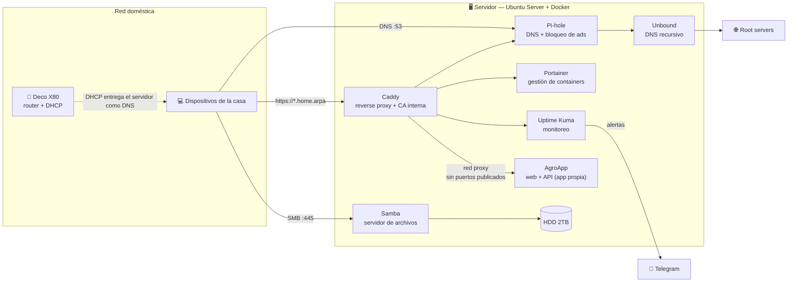
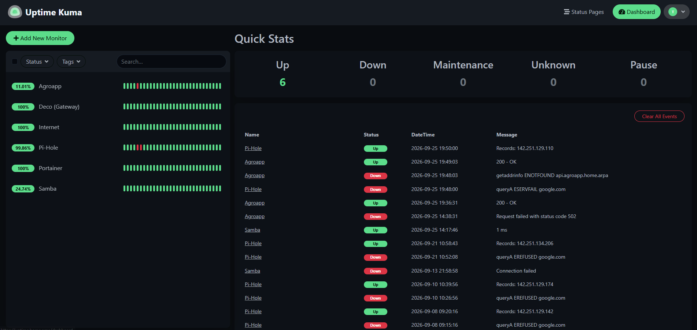
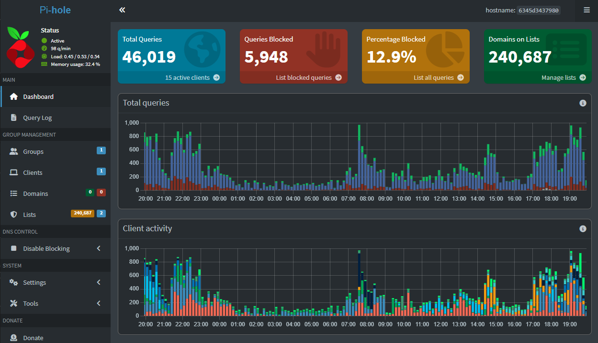
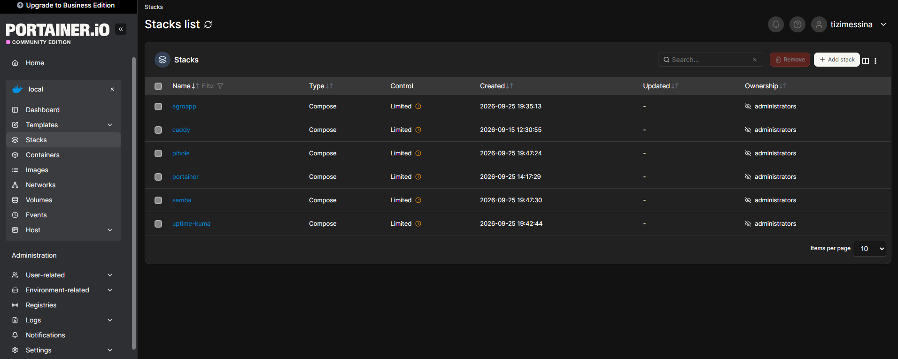

# 🏠 Homelab

Infraestructura casera para aprender Sysadmin, Cloud Engineering y AIOps con las manos en la masa — cada servicio documentado, versionado como código, y con la bitácora real de los problemas que aparecieron (y cómo se resolvieron) en el camino.


> 🇬🇧 **English summary:** A self-hosted homelab running on a recycled 2014 all-in-one PC (Celeron J1800, 4GB RAM) with Ubuntu Server and Docker Compose. It provides network-wide DNS with ad blocking and recursive resolution (Pi-hole + Unbound), an internal reverse proxy with its own certificate authority (Caddy), uptime monitoring with Telegram alerts (Uptime Kuma), a file server (Samba) and container management (Portainer). It also hosts my own application (AgroApp) behind the reverse proxy, with no ports exposed on the host. Every service is defined as code, and each folder documents the real troubleshooting it took to get it working. Docs are in Spanish.

---

## 📖 Sobre este proyecto

Este repo es la base de mi laboratorio casero, pensado como terreno de práctica real para mi camino hacia **Infraestructura / Sysadmin / Cloud Engineering**, con **AIOps** como capa adicional de interés — no como reemplazo del foco en infra, sino como una herramienta más arriba de ella.

La idea no es solo "instalar cosas" — cada carpeta de este repo tiene su propio `docker-compose.yml` versionado y, cuando aplica, un `README.md` con el troubleshooting real que hizo falta para dejarlo andando. Si algo se rompió, quedó anotado el porqué y el fix, en vez de barrerlo bajo la alfombra.

## 🏗️ Arquitectura



## 🖥️ El hardware

| | |
|---|---|
| **Equipo** | Lenovo All-in-One C260 (2014/2015) |
| **CPU** | Intel Celeron J1800 @ 2.41GHz, dual-core |
| **RAM** | 4GB (3.89GB usables) |
| **Disco sistema** | SSD WD Blue 120GB (SATA) |
| **Disco datos** | HDD Seagate 2TB (único dispositivo en el bus USB) |
| **Red** | Ethernet Gigabit (Realtek RTL8111) conectado directo al Deco X80 — sin nodos ni extensores intermedios. Ver historia completa en [Topología de red](#-topología-de-red-y-su-historia) |
| **SO** | Ubuntu Server 26.04 LTS |

Hardware modesto a propósito — parte del ejercicio es aprender a tomar buenas decisiones de arquitectura *a pesar de* las limitaciones de recursos, no ignorándolas. Cada elección de stack (Docker en vez de Proxmox, SQLite en vez de MariaDB donde aplica, etc.) está pensada primero para este hardware real.

## 🧱 Stack y filosofía

- **Docker + Docker Compose** como runtime base — contenedores en vez de VMs completas, la skill que más se transfiere directo a Cloud (ECS, EKS, Cloud Run).
- **Un `docker-compose.yml` por servicio**, cada uno en su propia carpeta, como ejercicio de Infrastructure as Code liviano. Los servicios que necesitan secretos traen un `.env.example` con las variables a completar.
- **Todo versionado en Git** desde el día uno — decisiones, configs y fixes quedan documentados, no solo en mi cabeza.
- **`.env` y datos persistentes nunca se suben** — solo la infraestructura como código.
- **Mínimo privilegio por default** — el socket de Docker solo se monta donde es imprescindible (Portainer), y ningún servicio se expone fuera de la LAN.
- **Apps propias sin puertos en el host** — las aplicaciones nuevas (como AgroApp) solo viven en una red Docker compartida con Caddy, que es el único punto de entrada.

## 📦 Servicios

| Servicio | Qué hace | Estado |
|---|---|---|
| [`pihole/`](./pihole) | DNS propio con bloqueo de ads (Pi-hole, ~271k dominios) + resolución recursiva sin terceros (Unbound) | ✅ Funcionando |
| [`portainer/`](./portainer) | Panel visual de gestión de containers | ✅ Funcionando |
| [`samba/`](./samba) | Servidor de archivos sobre el disco Seagate | ✅ Funcionando |
| [`uptime-kuma/`](./uptime-kuma) | Monitoreo de disponibilidad de 5 puntos clave de la red, con alertas por Telegram | ✅ Funcionando |
| [`caddy/`](./caddy) | Reverse proxy — acceso a cada servicio por nombre (`servicio.home.arpa`) con HTTPS vía CA interna | ✅ Funcionando |
| [`agroapp/`](./agroapp) | Despliegue de AgroApp (app propia, repo aparte) detrás de Caddy, sin puertos expuestos | ✅ Funcionando |
| [`host/`](./host) | Configuración del sistema operativo fuera de Docker (servicios systemd) | ✅ Funcionando |
| `backups/` | Backups automáticos de volúmenes y configs | 🔜 Próximo |
| `gitea/` | Git self-hosted + runner CI/CD | 🔜 Planeado |
| `wireguard/` | VPN para acceso remoto a la red doméstica | 🔜 Planeado |

Cada carpeta con servicio activo tiene su propio README con arquitectura, setup, y — cuando lo hubo — el troubleshooting real documentado paso a paso.

### Levantar un servicio

```bash
cd <servicio>/
cp .env.example .env   # solo si la carpeta trae .env.example — completar los valores
docker compose up -d
```

## 🔧 Problemas reales resueltos (destacados)

Una selección de los diagnósticos más interesantes; el detalle completo está en el README de cada servicio.

- **DNS que no respondía a nadie de la LAN** — Pi-hole descartaba en silencio todas las consultas. Se descartaron en orden el DNS manual del cliente, el aislamiento de clientes del router (con `tcpdump`) y las reglas NAT de Docker, hasta encontrar en el log de FTL que el `listeningMode LOCAL` trataba el tráfico NAT-eado como externo. → [pihole/](./pihole)
- **Variables de entorno que se ignoraban sin avisar** — Pi-hole v6 dejó de leer `PIHOLE_DNS_` y `WEBPASSWORD` de v5; la pista fue un conteo de variables en el log de arranque. → [pihole/](./pihole)
- **Dos gestores de red peleando por la misma interfaz** — NetworkManager y Netplan reactivando el WiFi después de haberlo desactivado. → [Topología de red](#gotcha-networkmanager-vs-netplan-peleando-por-la-misma-interfaz)
- **Cuatro configuraciones de red medidas con datos** — de un dongle USB que falló por hardware a Gigabit real, validando cada paso con `dmesg`, `ethtool`, `speedtest-cli` y mediciones de jitter. → [Topología de red](#-topología-de-red-y-su-historia)
- **Red de Docker corrupta tras un corte de luz** — `Address already in use` en una IP fija sin ningún container usándola. → [pihole/](./pihole)
- **Pantalla física que no se apagaba** — tres métodos fallidos (y por qué) antes de llegar al framebuffer del kernel. → [Apagado del panel físico](#-apagado-del-panel-físico)

## 🌐 Topología de red (y su historia)

El servidor pasó por cuatro configuraciones de conectividad distintas, cada una diagnosticada con datos reales en vez de intuición.

**1. Dongle WiFi USB** (setup original) — compartía bus USB con el disco Seagate, sujeto a autosuspend y drivers menos maduros. Terminó fallando por hardware (`device descriptor read/64, error -32` en `dmesg`).

**2. Ethernet vía extensor de rango** (fix de emergencia) — al fallar el dongle, se conectó por cable hasta un extensor de rango WiFi 4 que hacía de puente hacia el Deco. Resolvió el problema de hardware, pero expuso dos cuellos de botella nuevos: el puerto Ethernet del extensor era Fast Ethernet (100Mbps, confirmado con `ethtool`), y el backhaul extensor↔Deco por WiFi 4 sufría "double dip" (un solo radio repartiendo turnos entre hablar con el servidor y con el Deco) — confirmado con `speedtest-cli`: subida errática entre 2.9 y 39 Mbps.

**3. WiFi interno directo al Deco** — usando la placa integrada de la Lenovo (Realtek RTL8188EE, gama baja, pero con señal al 100% por estar físicamente cerca del Deco). Eliminaba el salto intermedio del extensor. Mejoró la subida (74-81 Mbps estable) pero seguía siendo un enlace inalámbrico, con ~1.3% de pérdida ocasional.

**4. Ethernet directo al Deco (configuración actual y definitiva)** — se reubicó físicamente el servidor debajo del router y se conectó por cable Cat5e directo al Deco X80 (único router de la red, sin nodos ni extensores). `ethtool` confirma `1000baseT/Full` negociado en ambos extremos — Gigabit real de punta a punta. Ping con jitter de apenas 0.352ms, el más estable medido en las cuatro configuraciones.

### Gotcha: NetworkManager vs Netplan peleando por la misma interfaz

Durante la migración de la config 3 a la 4, la interfaz WiFi (`wlp3s0`) seguía reconectándose sola después de declararla `down` y sacarla del Netplan. Causa: en la config 3 se había usado `nmcli connection add/connect` para conectar rápido al WiFi, lo cual crea un perfil **persistente en NetworkManager** — un gestor de red completamente separado de Netplan/systemd-networkd. Ambos pueden coexistir en el mismo Ubuntu Server, y cuando lo hacen sin coordinación, cada uno cree tener autoridad sobre la interfaz.

Fix: `nmcli connection delete <nombre-del-perfil>` para borrar el perfil persistente, no solo `ip link set down`.

**Lección para el futuro:** usar `nmcli` para una conexión rápida de emergencia está bien, pero si después se declara la configuración definitiva en Netplan, hay que acordarse de borrar el perfil de NetworkManager — sino quedan dos gestores de red compitiendo por la misma interfaz sin que sea evidente por qué.

### Configuración final

Una sola interfaz activa (`enp2s0`, Ethernet), sin WiFi de respaldo por ahora. IP fija `192.168.10.150` mediante reserva DHCP en el Deco, atada a la MAC de la placa Ethernet. Pi-hole escucha en `0.0.0.0`, así que responde sin importar la interfaz por la que llegue la consulta.

## 🖥️ Apagado del panel físico

El servidor no tiene monitor conectado en uso normal (headless, acceso por SSH), pero el panel integrado del AIO quedaba encendido indefinidamente a pesar de `consoleblank` configurado en GRUB.

Se probaron 3 métodos antes de encontrar uno que funcionara en este hardware:

- `consoleblank=60` (kernel param) — solo pone texto negro, no dispara DPMS real
- `vbetool dpms off` — falla con "Real mode call failed" (necesita BIOS legacy, el equipo arranca en UEFI)
- `setterm --blank force` — falla por detección de terminal (`TERM` no soportado), incluso corriendo sin sesión SSH de por medio

**Lo que funciona:** escribir directo al framebuffer del kernel:

```bash
echo 4 | sudo tee /sys/class/graphics/fb0/blank   # apagar (powerdown real)
echo 0 | sudo tee /sys/class/graphics/fb0/blank   # reactivar si hace falta
```

Automatizado como servicio systemd que corre una vez en cada arranque — la unidad está versionada en [`host/screen-off.service`](./host/screen-off.service).

## 🗺️ Roadmap general

```
Docker + Git ──► Pi-hole + Unbound ──► Portainer ──► Samba ──► Uptime Kuma ──► Reverse Proxy (Caddy) ✅
                                                                                        │
        ┌───────────────────────────────────────────────────────────────────────────────┘
        ▼
  Backups ──► Gitea + CI/CD ──► WireGuard
        │
        └──► AIOps: n8n/Node-RED + API de Claude sobre logs y alertas
```

Este homelab alimenta directo mi camino hacia certificaciones AWS (arrancando por Cloud Practitioner) y sirve de entorno de práctica para Terraform.

<!--
## 📸 Capturas

Descomentar cuando estén las imágenes en docs/img/




-->

## 🎯 Por qué existe este repo

Además de ser mi entorno de aprendizaje, este repo funciona como evidencia de trabajo real para mi perfil profesional — no tutoriales seguidos al pie de la letra, sino diagnóstico y resolución de problemas reales de infraestructura, documentados a medida que aparecen.

---

📍 Cada servicio vive en su propia carpeta con su `docker-compose.yml` y documentación puntual. Este README se va a ir actualizando a medida que se sumen proyectos nuevos.
